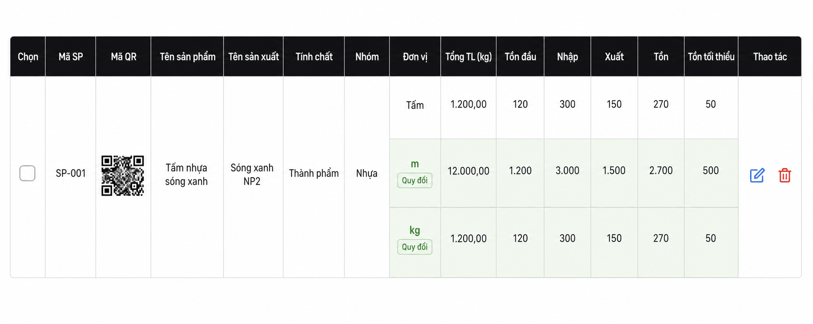

# Plan danh sách sản phẩm có nhiều dòng quy đổi

## Mục tiêu

- Router áp dụng: `/san-pham`.
- Chỉ hiển thị sản phẩm có `Tính chất = Thành phẩm` trong thiết kế danh sách quy đổi này.
- Mỗi sản phẩm là một **nhóm dòng** thay vì một dòng bảng phẳng.
- Sáu vùng thông tin sản phẩm giữ chung một lần: Mã SP, Mã QR, Tên sản phẩm, Tên sản xuất, Tính chất, Nhóm.
- Ô Chọn và ô Thao tác cũng chỉ xuất hiện một lần cho cả nhóm.
- Từ cột Đơn vị đến Tồn tối thiểu, mỗi đơn vị nguồn/quy đổi chiếm một dòng riêng.

## Mockup trường hợp Tấm → m và kg



Mockup minh họa cấu trúc mong muốn; số liệu trong ảnh chỉ dùng mô tả bố cục, không phải dữ liệu nghiệp vụ chuẩn.

## Cấu trúc một nhóm sản phẩm

Ví dụ sản phẩm có ĐVT gốc `Tấm` và quy đổi được thêm `m`, `kg` thì nhóm có 3 dòng:

| Phần | Dòng 1 | Dòng 2 | Dòng 3 |
|---|---|---|---|
| Chọn → Nhóm | Gộp dọc 3 dòng | Dùng chung | Dùng chung |
| Đơn vị | `Tấm` | `m` | `kg` |
| Tổng TL → Tồn tối thiểu | Dữ liệu gốc | Dữ liệu đổi sang m | Dữ liệu đổi sang kg |
| Thao tác | Gộp dọc 3 dòng | Dùng chung | Dùng chung |

Triển khai HTML bằng `rowSpan = 1 + số đơn vị quy đổi` cho:

- Checkbox
- Mã SP
- Mã QR
- Tên sản phẩm
- Tên sản xuất
- Tính chất
- Nhóm
- Thao tác

Không dùng `rowSpan` cho:

- Đơn vị
- Tổng TL
- Tồn đầu
- Nhập
- Xuất
- Tồn
- Tồn tối thiểu

## Xác định các đơn vị quy đổi được hiển thị

ĐVT gốc lấy từ `san_pham.don_vi`. Các dòng con chỉ sinh khi đủ hệ số:

### ĐVT gốc `Tấm`

- Thêm dòng `m` khi có `kho_tam_dai_m`:
  - `m = Tấm × kho_tam_dai_m`.
- Thêm dòng `kg` khi có một trong hai bộ:
  - `kg = Tấm × trong_luong_kg_tam`.
  - Hoặc `kg = Tấm × kho_tam_dai_m × trong_luong_kg_m_dai`.

### ĐVT gốc `m`

- Không sinh lại dòng `m`.
- Thêm dòng `kg` khi:
  - `kg = m × trong_luong_kg_m_dai`.
  - Hoặc `kg = m × khổ rộng × trong_luong_kg_m2`.
- Có thể thêm dòng `Tấm` khi có `kho_tam_dai_m`:
  - `Tấm = m ÷ kho_tam_dai_m`.

### ĐVT gốc `m2`

- Thêm dòng `kg` khi có `trong_luong_kg_m2`:
  - `kg = m2 × trong_luong_kg_m2`.
- Thêm dòng `m` khi có khổ rộng:
  - `m = m2 ÷ khổ rộng`.
- Khổ rộng ưu tiên `kho_tam_rong_m`, sau đó `kho_cuon_rong_m`.

### Quy tắc chung

- Không sinh dòng trùng ĐVT gốc.
- Không sinh dòng nếu thiếu hệ số.
- Thứ tự dòng: ĐVT gốc → `m` → `m2` → `Tấm` → `kg`, bỏ qua đơn vị không tồn tại.
- Mỗi sản phẩm chỉ lấy bản ghi `san_pham_quy_doi` liên kết bằng `san_pham_id`.

## Các cột số lượng cần quy đổi

Áp dụng cùng một công thức cho từng giá trị:

- Tồn đầu
- Nhập
- Xuất
- Tồn
- Tồn tối thiểu

Giá trị `0` phải hiển thị là `0`, không đổi thành `—`. Giá trị rỗng, `-`, không phải số hoặc không đủ hệ số hiển thị `—`.

### Cột Tổng TL (kg)

- Dòng gốc: giữ cách hiển thị hiện tại.
- Dòng `kg`: hiển thị giá trị kg phù hợp với dữ liệu nguồn nếu có định nghĩa nghiệp vụ rõ ràng.
- Dòng `m`, `m2`, `Tấm`: không dùng `tong_trong_luong` để suy ngược; mặc định `—`.
- Không nhân lại một giá trị vốn đã là kg.

## UI/UX

- Dòng gốc nền trắng, chữ đậm hơn.
- Dòng quy đổi dùng nền xám rất nhạt giống bảng hiện có, không có hiệu ứng đổi màu khi hover.
- ĐVT dòng con chỉ hiển thị tên đơn vị, không thêm badge hoặc chữ `Quy đổi`.
- Viền trên đậm hơn ở đầu mỗi nhóm sản phẩm.
- Hover bất kỳ dòng nào làm nổi cả nhóm; có thể quản lý `hoveredProductId`.
- Checkbox, QR và menu Thao tác căn giữa theo toàn bộ chiều cao nhóm.
- Sticky cột Thao tác áp dụng trên ô `rowSpan`, không lặp nút sửa/xóa.
- Search/filter xử lý sản phẩm cha; các dòng con luôn đi cùng cha.
- In QR, chọn hàng loạt, sửa và xóa vẫn thao tác trên `san_pham.id`, không thao tác trên dòng quy đổi.

## Kiến trúc code

### Utility dùng chung

Tách thuật toán khỏi UI, dùng chung với `/don-hang`:

```ts
type ConvertedUnit = 'm' | 'm2' | 'Tấm' | 'kg';

convertProductQuantity(
  quantity: number,
  sourceUnit: string,
  targetUnit: ConvertedUnit,
  conversion: ProductConversion
): number | null;
```

Hàm phải thuần, không gọi API và không format chuỗi. UI chỉ format kết quả tối đa 3 chữ số thập phân.

### Chuẩn bị dữ liệu

1. Tải toàn bộ `san_pham_quy_doi` một lần.
2. Tạo `Map<san_pham_id, ProductConversion[]>` bằng `useMemo`.
3. Với mỗi Thành phẩm, tạo:

```ts
{
  product,
  rows: [
    { unit: product.unit, kind: 'source', values: ... },
    { unit: 'm', kind: 'converted', values: ... },
    { unit: 'kg', kind: 'converted', values: ... }
  ]
}
```

4. Render từng nhóm bằng `<React.Fragment>` và `rowSpan`.

## Xử lý lỗi

- Lỗi tải bảng quy đổi không làm mất danh sách `san_pham`.
- Hiển thị toast tiếng Việt: `Không thể tải bảng quy đổi. Dữ liệu sản phẩm gốc vẫn được hiển thị.`
- Sản phẩm chưa có quy đổi: chỉ hiển thị dòng gốc.
- Không hiển thị `TypeError`, lỗi Supabase hoặc tên bảng trực tiếp cho người dùng.

## Các bước thực hiện

1. Tách utility quy đổi dùng chung với `/don-hang`.
2. Tải và map `san_pham_quy_doi` trong `/san-pham`.
3. Chỉ lấy `filteredProducts` có tính chất Thành phẩm theo yêu cầu màn hình.
4. Tạo danh sách đơn vị nguồn và đơn vị con cho từng sản phẩm.
5. Thay render một dòng bằng render nhóm dòng có `rowSpan`.
6. Đồng bộ hover, sticky Thao tác, checkbox và QR.
7. Kiểm tra tìm kiếm, chọn hàng loạt, sửa, xóa và in QR.
8. Cập nhật manifest `docs/ai-tables/san_pham.md`.
9. Build frontend, server, Vercel handler.

## Case kiểm thử

1. Thành phẩm `Tấm`, có `dài/tấm + kg/tấm`: hiện Tấm, m, kg.
2. Thành phẩm `Tấm`, có `dài/tấm + kg/m`: hiện Tấm, m, kg.
3. Thành phẩm `Tấm`, chỉ có dài/tấm: hiện Tấm, m.
4. Thành phẩm `m`, có kg/m: hiện m, kg.
5. Thành phẩm `m2`, có khổ rộng + kg/m2: hiện m2, m, kg.
6. Thành phẩm thiếu bảng quy đổi: chỉ hiện dòng gốc.
7. Sản phẩm không phải Thành phẩm: không xuất hiện trong danh sách theo phạm vi yêu cầu.
8. Một giá trị tồn là 0: tất cả dòng đổi tương ứng hiển thị 0.
9. Các nút Sửa/Xóa chỉ xuất hiện một lần.
10. Search và checkbox không tạo dòng con mồ côi.

## Điều kiện hoàn thành

- Một sản phẩm tương ứng một nhóm trực quan.
- Có bao nhiêu đơn vị quy đổi hợp lệ thì sinh đúng bấy nhiêu dòng con.
- Sáu cột thông tin, checkbox và Thao tác chỉ hiển thị một lần.
- Kết quả danh sách và `/don-hang` dùng chung một nguồn công thức.
- Không lưu dòng quy đổi vào `san_pham`; chỉ tính để hiển thị.
